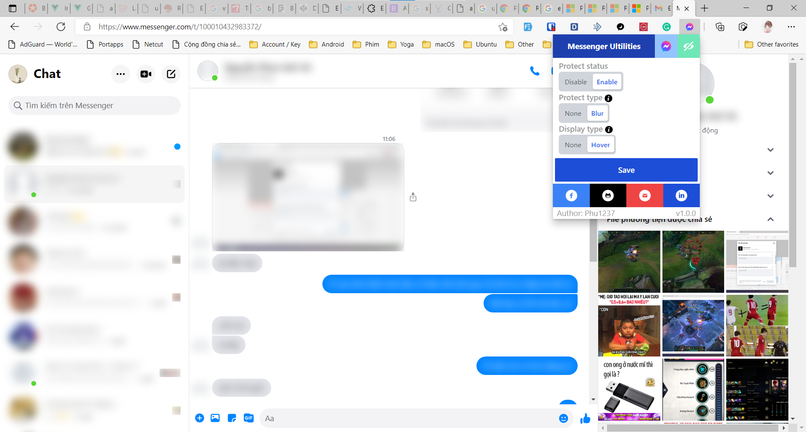
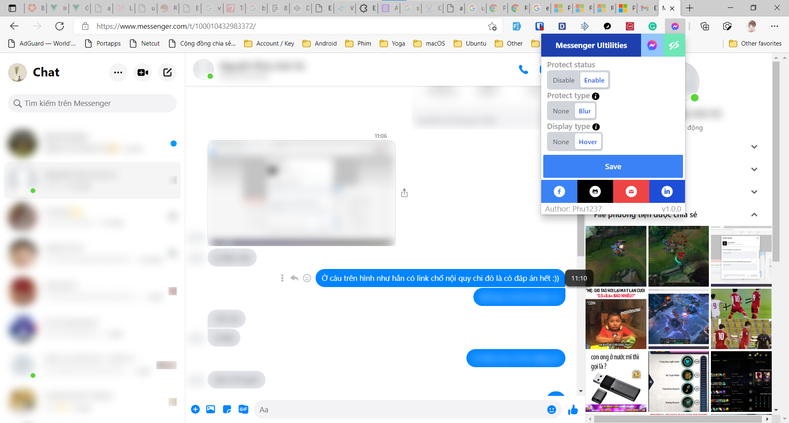

# Messenger Utilities

Utilities for Facebook Messenger
Extension for Chrome / Edge / Opera / Chromium based browser

## Features

Available features:

- Protect your privacy, let you control what and when contents should be display in messenger.com.

Under development features:

- Password protect for extension
- Password protect for messenger.com

## Download

Get it from extension store:

- [Edge](https://microsoftedge.microsoft.com/addons/detail/dikgifmgfijhmfapckmkbgldlljmihea)
- [Opera](https://addons.opera.com/en/extensions/details/messenger-utilities)

Or you can download the released version [here](https://github.com/Phu1237/extension-messenger-utilities/releases/latest).

## Instructions

- Video:
  - [Youtube](https://youtu.be/xYn46sTrNPI)
- Screenshots:

More? Go to [screenshots](screenshots)

## How to build

### Requirements

- [Nodejs](https://nodejs.org/) or [Yarn](https://yarnpkg.com/)
- [VSCode](https://code.visualstudio.com/) + [Volar](https://marketplace.visualstudio.com/items?itemName=johnsoncodehk.volar) (Recommended)

### Build

Run the following command:

| |Production|Development|
|-|-|-|
|Npm|`npm run build`|`npm run build:dev`
|Yarn|`yarn build`|`yarn build:dev`

Turn on the **developer mode** and move the "dist" folder into the **extensions page**.

## Contributors

Thanks to those people for helping me develop this extension:

- [yensubldg](https://github.com/yensubldg)
