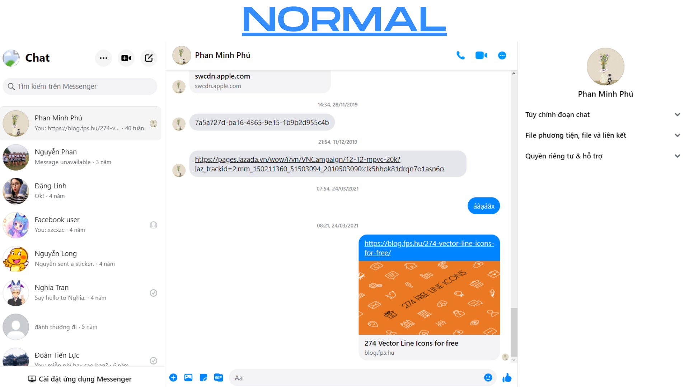
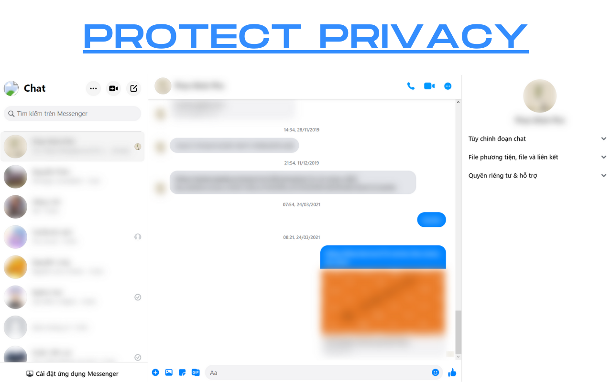

# Messenger Utilities

Utilities for Facebook Messenger
Extension for Chrome / Edge / Opera / chromium based browser

## Features

Available features:

- Protect your privacy, let you control what and when contents should be display in messenger.com.

Under development features:

- Password protect for extension
- Password protect for messenger.com

## Download

You can download the released version [here](https://github.com/Phu1237/extension-messenger-utilities/releases/latest/download/messenger-utilities.zip).

## Screenshots




## How to build

### Requirements

- [Nodejs](https://nodejs.org/) or [Yarn](https://yarnpkg.com/)

### Build

Run the following command:

```bash
npm install
npm run prod
# or
yarn install
yarn run prod
```

And then, go to the "dist" directory folder to view built files.

## Contributors

Thanks to those people for helping me develop this extension:

- [yensubldg](https://github.com/yensubldg)
