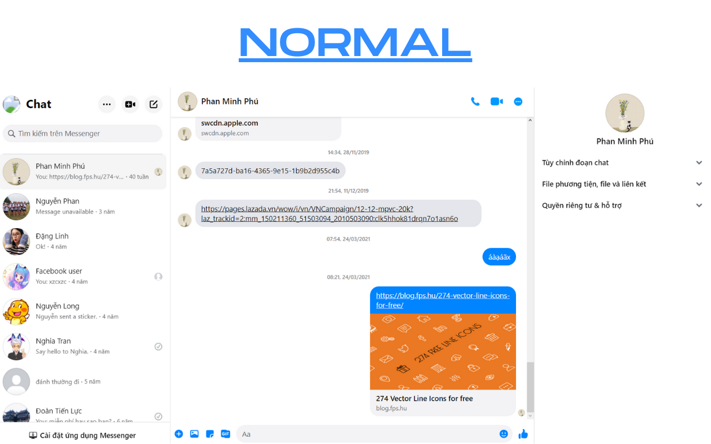
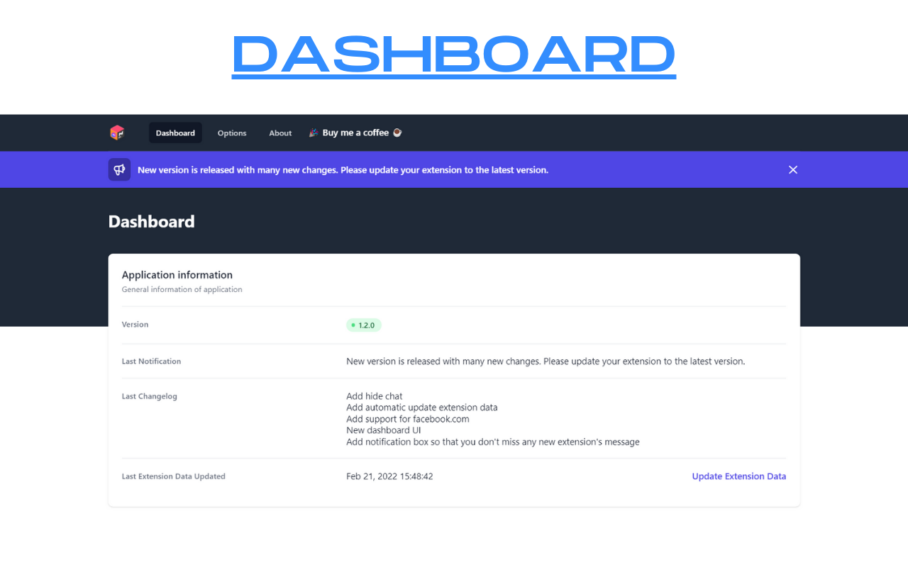

# Messenger Utilities

Utilities for Facebook Messenger
Extension for Chrome / Edge / Opera / Chromium-based browsers

## Features

Available features:

- Protect your privacy
  - Protect content: Let you control what and when content should be displayed on messenger.com
  - Protect title: Hide the new messages title of the page (ex: Someone sent you a new message)
- Hide chat: Hide the chat from the list of chats

Under development features:

- Password protection

## Download

Get it from the extension store:

- [Chrome](https://chrome.google.com/webstore/detail/messenger-utilities/hgjapmpobhggbolomlplijepenpbefld)
- [Edge](https://microsoftedge.microsoft.com/addons/detail/dikgifmgfijhmfapckmkbgldlljmihea)
- [Opera](https://addons.opera.com/en/extensions/details/messenger-utilities)

Or you can download the released version [here](https://github.com/Phu1237/extension-messenger-utilities/releases/latest).

## Instructions

- Video:
  - [Youtube](https://youtu.be/xYn46sTrNPI)
- Screenshots:

## How to build

### Requirements

- [Nodejs](https://nodejs.org/) or [Yarn](https://yarnpkg.com/)
- [VSCode](https://code.visualstudio.com/) + [Vue - Official](https://marketplace.visualstudio.com/items?itemName=Vue.volar) (Recommended)

### Build

Edit **.env** file
Run the following command:

| |Production|Development|
|-|-|-|
|Npm|`npm run build`|`npm run build:dev`
|Yarn|`yarn build`|`yarn build:dev`

Turn on the **developer mode** and move the "dist" folder to the **extensions page**.

## Donations

If you like my work, please consider buying me a coffee ☕

- [Buy me a coffee](https://www.buymeacoffee.com/Phu1237)
- [Momo](https://me.momo.vn/Phu1237)

## Contributors

Thanks to those people for helping me develop this extension:

- [yensubldg](https://github.com/yensubldg)
